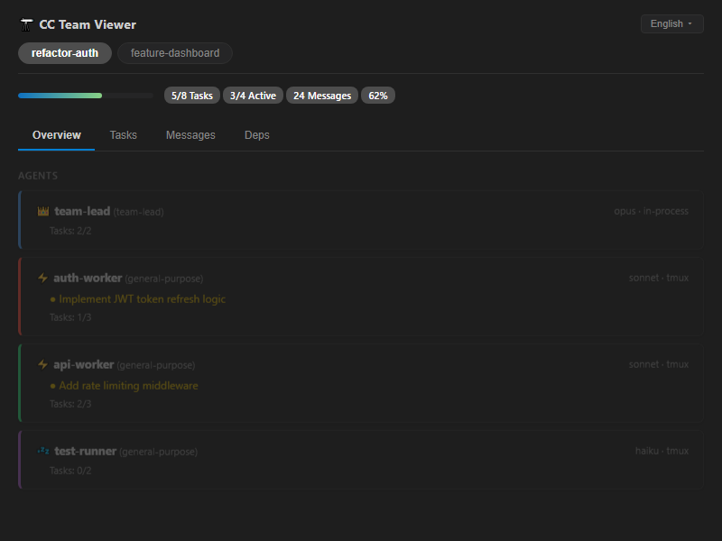
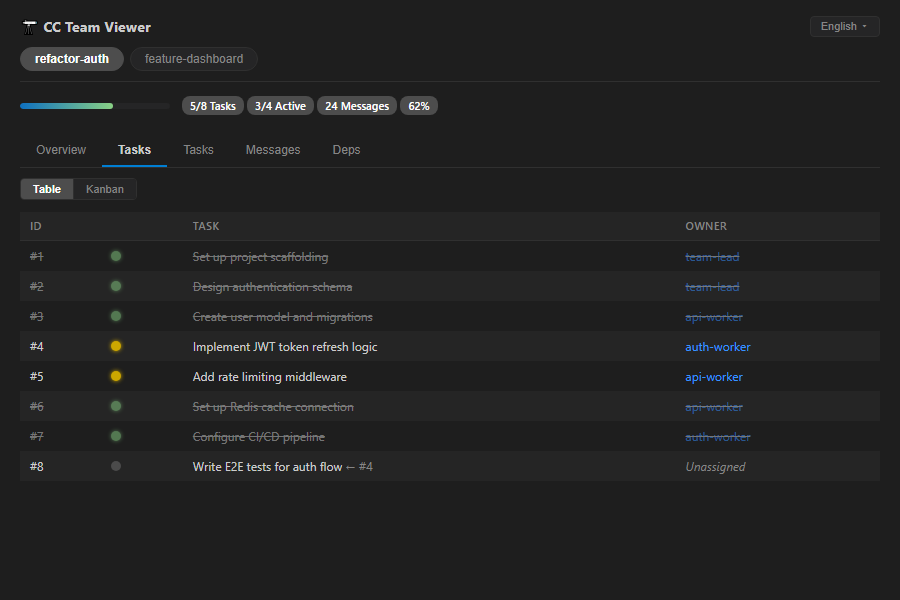
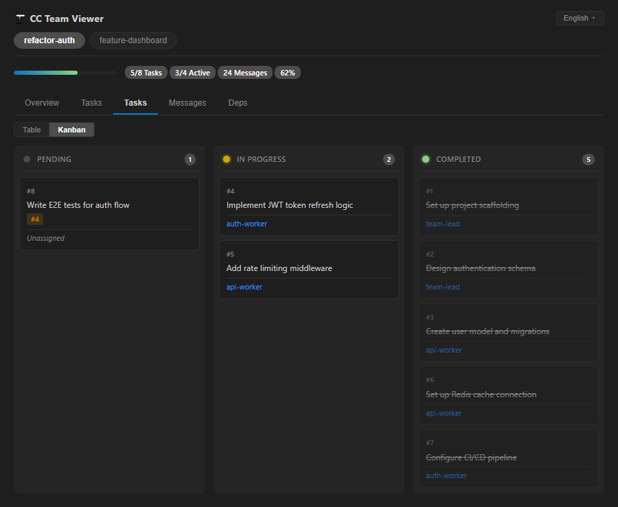
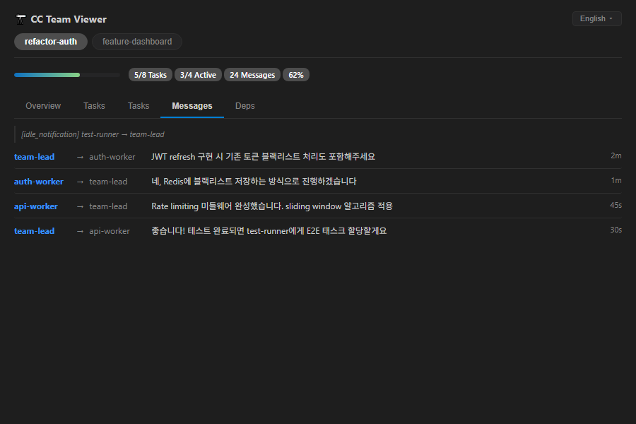

# CC Team Viewer

**Claude Code Agent Teams 实时监控工具**

[](https://www.npmjs.com/package/@cc-team-viewer/core)
[](https://www.npmjs.com/package/@cc-team-viewer/tui)
[](https://marketplace.visualstudio.com/items?itemName=koh-dev.cc-team-viewer-vscode)

[English](README.md) | [한국어](README.ko.md) | [日本語](README.ja.md)



> **这是什么？** 实时监控 [Claude Code Agent Teams](https://code.claude.com/docs/en/agent-teams) 的 VS Code 扩展和终端 UI。一目了然地查看每个代理的状态、任务进度和代理间消息 — 无需额外配置，开箱即用。

## 为什么需要？

Claude Code 的 Agent Teams 功能强大，但监控方式有限：
- 用 `Shift+Down` 在代理间切换
- 用 `Ctrl+T` 查看任务列表
- 手动检查 tmux 窗格

CC Team Viewer 实时监视 `~/.claude/teams/` 和 `~/.claude/tasks/` 目录中的 JSON 文件，在独立的终端窗格或 VS Code 面板中展示团队全貌。

## 功能

- **团队概览** — 活跃团队、成员数、整体进度
- **代理状态** — 每个代理的当前任务、模型(opus/sonnet/haiku)、后端类型。点击/Enter展开负责任务列表
- **任务看板** — 表格/看板视图切换(`K`)、状态、负责人、依赖关系、阻塞。点击/Enter展开任务详情面板
- **消息日志** — 代理间通信实时显示，筛选器(全部/对话/系统，`F`循环切换)及线程分组
- **依赖图** — 拓扑排序层级可视化，框线节点(TUI)及CSS Grid + SVG Bezier曲线(VS Code)
- **进度统计** — 完成率、耗时、每个代理的吞吐量
- **键盘导航 (TUI)** — `Enter`/`Esc`焦点模式、`↑/↓`光标、`K`看板切换、`F`消息筛选
- **多语言支持** — English、한국어、日本語、中文







## 包结构

```
packages/
├── core/     # 文件监视 + JSON 解析 + 事件（共享库）
├── tui/      # 终端 UI（基于 ink，兼容 Windows Terminal/iTerm2/tmux）
└── vscode/   # VS Code 扩展（侧边栏面板 + WebView 仪表板）
```

## 快速开始

### VS Code 扩展（推荐）

从 [VS Code Marketplace](https://marketplace.visualstudio.com/items?itemName=koh-dev.cc-team-viewer-vscode) 安装：

```
ext install koh-dev.cc-team-viewer-vscode
```

### 终端 TUI

```bash
npm install -g @cc-team-viewer/tui
cc-team-viewer
```

### 作为库使用

```bash
npm install @cc-team-viewer/core
```

```typescript
import { TeamWatcher } from "@cc-team-viewer/core";

const watcher = new TeamWatcher();
watcher.on("snapshot:updated", (teamName, snapshot) => {
  console.log(`${teamName}: ${snapshot.stats.completionRate}% 完成`);
});
await watcher.start();
```

### 从源码构建

```bash
git clone https://github.com/koh0001/cc-team-viewer.git
cd cc-team-viewer
npm install && npm run build
npm run tui
```

## 兼容性

| 环境 | TUI | VS Code 扩展 |
|------|-----|-------------|
| macOS (iTerm2/Terminal) | 支持 | 支持 |
| macOS (tmux pane) | 支持 | - |
| Windows (原生) | 支持 | 支持 |
| Windows (WSL) | 支持 | 支持 (Remote WSL) |
| Linux | 支持 | 支持 |

> **注意**：Agent Teams 本身以 tmux（split-pane）或 in-process 模式运行。
> CC Team Viewer 仅读取文件系统，因此在任何环境下都能工作。

## 系统要求

- Node.js 20+
- Claude Code（启用 Agent Teams）

## 开发

```bash
git clone https://github.com/koh0001/cc-team-viewer.git
cd cc-team-viewer
npm install
npm run dev        # TUI 开发模式（--watch）
npm run build      # 构建全部包
npm run test:run   # 运行测试
npm run lint       # ESLint 检查
```

## 许可证

[MIT](LICENSE)
